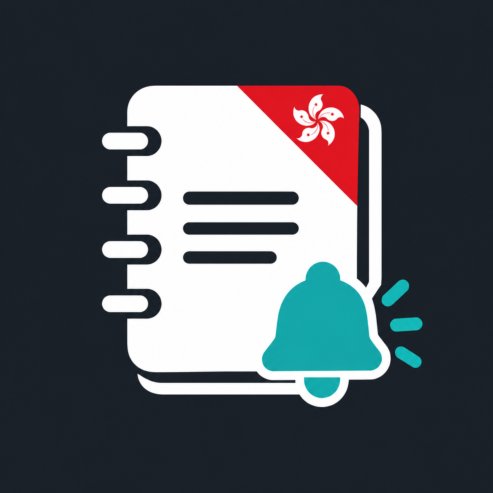

# HKTE Smart School for Home Assistant



An unofficial, read-only Home Assistant integration for the HKTE Smart School
parent app. It exposes a device for each child with notice, message and homework
summary sensors, deadline calendars and a new-item event entity.

> [!IMPORTANT]
> This community project is not affiliated with, endorsed by or supported by
> HKTE or HKT Education. It uses an undocumented interface used by the parent
> app. That interface can change without notice.

## Features

- Unread and unreplied notice counts
- Readable notice text with a native dashboard card
- Unread message count
- Unsubmitted, overdue and urgent homework counts
- Next homework deadline sensor
- Read-only notice and homework deadline calendars
- `notice`, `message` and `homework` events for Home Assistant automations
- English and Traditional Chinese translations
- Config flow, reauthentication and configurable 5-60 minute polling
- Authenticated attachment downloads (up to 20 MiB each)
- Optional AI summaries of notice text and PDF/JPEG/PNG attachments
- Optional automatic AI analysis for newly received notices, processed FIFO one at a time

The integration never marks an item as read, signs a notice, submits homework,
makes a payment or calls another state-changing endpoint. For notices that
advertise attachments, it may read display-safe metadata through
`GetNoticeData`. Only explicit download or AI-analysis requests retrieve files;
scheduled polling never downloads attachments or invokes AI.

## Install with HACS

1. Open HACS and select **Integrations**.
2. Open the menu and select **Custom repositories**.
3. Add `https://github.com/wfchan/hass-hkte-smart-school` as an **Integration**.
4. Download **HKTE Smart School** and restart Home Assistant.
5. Go to **Settings > Devices & services > Add integration**, search for
   **HKTE Smart School**, and enter the parent-app login name and password.

Only one HKTE account can be configured. The default update interval is 15
minutes and can be changed to a value from 5 to 60 minutes in integration
options.

## Read notice content

Each child has a **Notice content** sensor. Its `notices`
attribute contains the newest 20 distinct notices, sorted by issue date, with
title, plain-text content, dates, unread and reply status. Its numeric state is
the total fetched notice count; use the HACS card below to read the actual content.

For the recommended dashboard experience, add
`https://github.com/wfchan/hass-hkte-smart-school-card` to HACS as a
**Plugin**, install **HKTE Smart School Notices Card**, and add the generated
resource. Add `custom:hkte-notices-card` to a dashboard; it discovers every
child's notice-content sensor automatically, or accepts an explicit `entities`
list. It supports all/unread filtering, expandable bodies and attachment
metadata. The current pairing is card **0.2.6** with integration **0.4.5**;
automatic analysis of new notices is optional, queued FIFO and silent during the
first baseline sync.
The default remains five notices with the latest expanded; existing explicit
card settings are preserved.

As a dependency-free fallback, add a **Manual** card using
[examples/notices-card.yaml](examples/notices-card.yaml). It automatically
finds all children and expands the latest notice.
Reading or expanding a notice never changes its HKTE read/reply status.

Each body is limited to 20,000 characters, with `content_truncated` indicating
truncation. A missing body is explicitly shown as unavailable. Attachment
metadata may include only its ID, filename, MIME type and size. Attachment
contents are fetched only on request. HTML is converted to plain text with paragraph breaks;
scripts and embedded media are removed. The supplied card escapes provider
content and never loads embedded links or images.

## Attachment downloads and AI summaries

Install integration **0.4.5** and card **0.2.6** together. The download icon next
to each attachment uses your HA login and entity read permission. The server
checks notice/attachment ownership, obtains a fresh HKTE `uHubSid`, and requests
the verified HTTPS storage endpoint with `itemid` and `sid`. URLs, cookies and
session tokens stay on the server. Redirects, empty responses and error pages
are rejected. The metadata label may be `FILE`; file signatures identify PDF
and supported images. Other formats can be downloaded but not analyzed.
Download metadata is resolved through `GetAllNotices`, so accounts without a
working `GetNoticeData` endpoint can still download their attachments.

In **Settings > Devices & services > HKTE Smart School > Configure**, enable AI
and enter the Base URL (including `/v1` when your provider requires it), API key,
and an image-capable model. `/chat/completions` is appended to the Base URL.
Use HTTPS for remote services; HTTP is supported for trusted local services but
does not encrypt documents or credentials in transit. A blank API-key field
keeps the existing key. Disable AI to stop new analyses; downloads still work.

目前正式測試及支援的 AI model 只有 **MiniMax-M3**。其他 OpenAI-compatible
model 尚未測試，不保證能正確處理圖片輸入或輸出格式；後續會逐步加入及驗證
更多 model。OpenAI-compatible transport does **not** mean every model supports images or
structured output. The integration requests a strict JSON schema, then validates
all five sections, text limits and source/page references locally. Only an
explicit unsupported-format-parameter error permits a prompt-only fallback;
images are never silently removed. Invalid summary structure gets one retry.
Truncated or refused responses are rejected and existing summaries are preserved.
The card independently validates API data and displays empty sections as
"Not provided" / "未提供", without rendering model HTML or reasoning.

**MiniMax-M3**, using `https://api.minimax.io/v1`, passed live synthetic-image
tests on 2026-09-09. The integration automatically sets `reasoning_split: true`
for this official host, as described in the
[MiniMax OpenAI compatibility documentation](https://platform.minimax.io/docs/api-reference/text-openai-api).
Some providers ignore JSON schema hints; local validation is still mandatory.
These synthetic tests do not certify factual accuracy or every document layout.
No real school documents or credentials are included in the test fixtures.

The icon shown above is original, unofficial generated artwork for this community
integration. It is not an HKTE or school logo and contains no student data,
credentials or provider content.

Select **AI 整理重點** on a notice to send its text, attachment filenames and
rendered pages to **your configured AI provider**. This explicitly discloses
private school documents: select a provider whose privacy/retention policy you
accept. Nothing is sent automatically. Summaries are in Traditional Chinese,
with highlights, important dates, costs, parent actions, questions and page
citations. Missing dates/costs must be marked as not provided. Always verify AI
output against the original; the integration does not pay, reply or submit.

Each analysis permits at most **10 attachments, 40 MiB total and 20 pages**.
Limits fail explicitly; no pages are silently dropped. Corrupt, encrypted and
unsupported files are listed as missing in a partial result. If every attachment
fails, no new summary is generated. Truncated notice text is rejected. Progress,
safe errors, retry and reanalysis are shown in the card. One notice is processed
per account at a time; duplicate requests join the same job.

Valid results are reused. Changes to notice content, attachment metadata or model
settings mark a summary stale without triggering another request. Summaries and
source indexes are saved privately in HA `.storage` for **30 days**, at most
**200 results**, pruned hourly and on startup/save. They are not entity attributes
and do not enter Recorder. Original files are held only in bounded memory during
download/rendering and released on success, failure or cancellation; there is no
server-side file archive. An executor already rendering a page finishes before
its memory can be released. Files saved by your browser are yours to manage.

繁體中文：在整合選項填寫 AI Base URL、API key 及支援圖片的模型，啟用後才可手動
按「AI 整理重點」。目前只支援及測試 MiniMax-M3，其他 model 尚未測試，日後會逐步
加入新的支援。通告正文及附件頁面會傳送至你指定的服務；請先確認其私隱政策。
下載不需要啟用 AI。摘要保留 30 天；可另行開啟「收到新通告時自動進行 AI 分析」，
新通告會按順序逐份處理，首次同步只建立基線，不會分析現有通告；不會付款、簽署或標記通告已讀。

## New-item automations

Each child has a **New item** event entity. Trigger an automation when its event
type is `notice`, `message` or `homework`, then choose any notification action
available in your Home Assistant installation. Existing items form the initial
baseline and do not fire events during first setup.

Event attributes are limited to the child and item identifiers, title, provider
timestamp and deadline. Full notice content is deliberately excluded.

Example automation (replace the entity and notification action):

```yaml
alias: New school item
triggers:
  - trigger: state
    entity_id: event.test_child_new_item
conditions:
  - condition: template
    value_template: >-
      {{ trigger.from_state is not none and trigger.to_state is not none
         and trigger.to_state.state not in ['unknown', 'unavailable']
         and trigger.from_state.state != trigger.to_state.state }}
actions:
  - action: notify.mobile_app_your_phone
    data:
      title: School update
      message: "{{ trigger.to_state.attributes.title }}"
mode: queued
```

Calendars contain only deadlines returned by HKTE, not the school's complete
timetable. Unknown status fields are excluded from counts. Unread and unreplied
notices are independent states. Date-only homework deadlines use the end of the
Hong Kong calendar day in the timestamp sensor. New-item history retains up to
20,000 identifiers per child and category; older evicted items may be detected
again if the provider reintroduces them. Items without provider IDs use a stable
hash of identifying fields; changing those fields can produce a new event.

The data connection uses Home Assistant's shared HTTP connector with a separate
in-memory session for this account. It polls the documented read-only endpoints
sequentially and follows at most 200 pages per collection.

## Privacy and credentials

Home Assistant stores the login name, password and AI API key in its standard config-entry
storage. This storage is access-controlled by the Home Assistant host but is
not separately encrypted. Protect `.storage`, backups and host administrator
access. Session cookies remain in memory and are not written by this
integration.

Protect summary stores and backups too; they contain private school content.
Deleting the integration does not promise secure erasure of existing backups.

Notice text is visible to users and clients with access to Home Assistant
entity states. The `notices` attribute is excluded from Recorder history by
this integration, but external clients and user-created automations can still
copy it. Do not share screenshots or state exports containing private notices.
Bodies are never added to new-item events, diagnostics or the seen-ID store.

Diagnostics contain only record counts and timing information. Logs never
include credentials, cookies, raw provider responses, child names, school names
or notice content.

## Support

The minimum supported Home Assistant version is **2026.8.0**. Please use
[GitHub Issues](https://github.com/wfchan/hass-hkte-smart-school/issues) for bug
reports. Never include credentials, cookies, student details, notice text or
attachments in an issue.

## License

[MIT](LICENSE)

## Development

Use Python 3.14.2 or newer. Install `homeassistant==2026.8.3` (or `2026.9.1`),
`pytest-homeassistant-custom-component`, `pytest-aiohttp`, `ruff`, `mypy`,
`pypdfium2==5.13.0`, `Pillow==12.3.0` and `pypdf==6.0.0` (test fixtures only) in
an isolated environment. Run `pytest -q`, `ruff check .` and
`mypy custom_components/hkte_smart_school`. Fixtures are synthetic and only
the local test server opens sockets. CI tests both supported Home Assistant
series and validates repository metadata with HACS and Hassfest.
